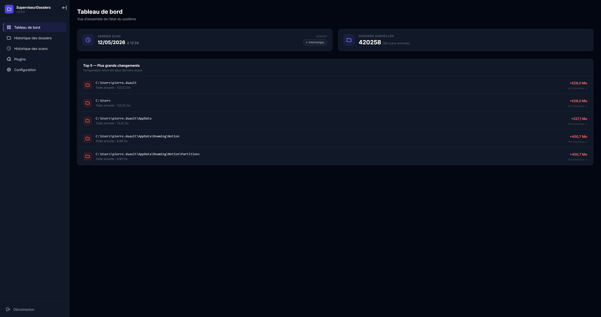
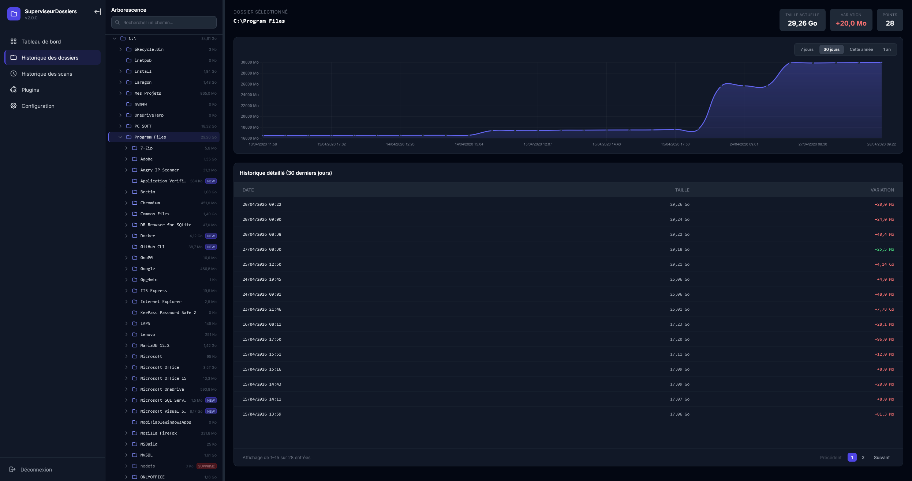
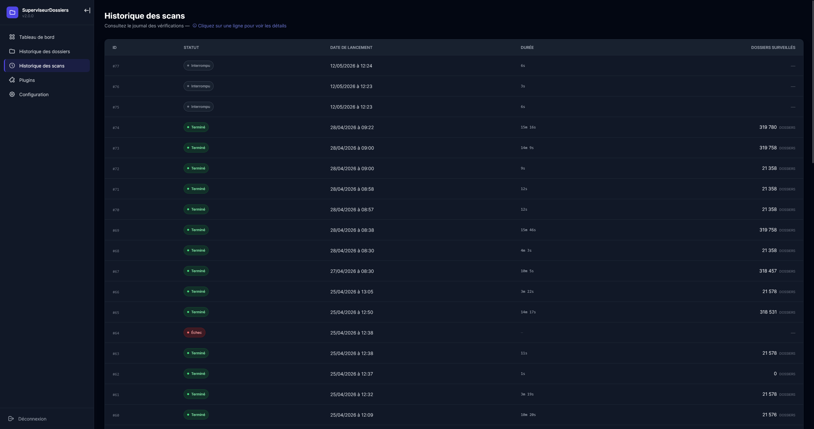
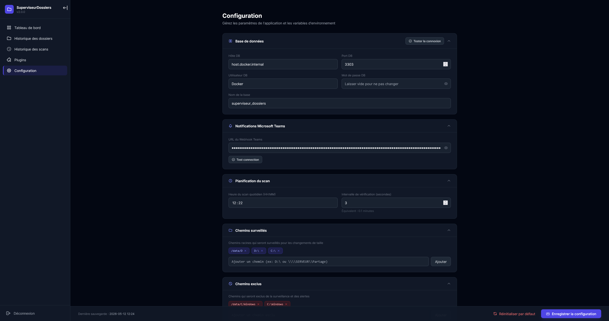
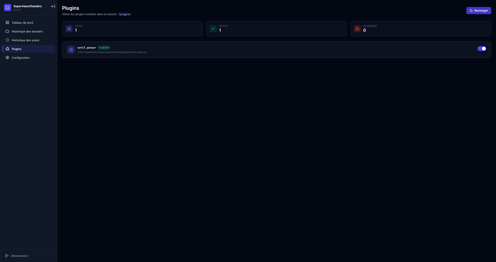

# 📁 Superviseur de Dossiers

Script Python déployé sur **Windows Server** qui analyse automatiquement la taille de tous les dossiers d'un chemin racine, stocke les résultats dans une base de données **MariaDB** (historisation complète) et envoie des notifications **Microsoft Teams** en cas de changements importants.

## 🖼️ Aperçu de l'interface

L'application embarque une interface d'administration web (Flask) activable via `INTRANET_ENABLED=1`.

| | |
|---|---|
|  |  |
| **Dashboard** — Vue d'ensemble des derniers scans | **Historique** — Arborescence et graphique d'évolution |
|  |  |
| **Scans** — Liste des scans avec détail par modale | **Paramètres** — Configuration complète de l'application |
|  |  |
| **Plugins** — Gestion et activation des plugins | **Connexion** — Page d'authentification |

## 📑 Sommaire

- [Fonctionnalités](#-fonctionnalités)
- [Prérequis](#-prérequis)
- [Base de données](#-base-de-données)
- [Configuration](#-configuration)
- [Installation](#-installation)
- [Système de Plugins](#-système-de-plugins)
- [Déploiement sur Windows Server](#-déploiement-sur-windows-server)
- [Structure du projet](#-structure-du-projet)
- [Technologies](#-technologies)

## 🎯 Fonctionnalités

- **Scan récursif** — Parcourt tous les dossiers et sous-dossiers à partir d'un chemin racine configurable
- **Exclusion de chemins** — Permet d'exclure des dossiers du scan (ex: `C:\Windows`)
- **Stockage en BDD** — Enregistre la taille de chaque dossier en Ko avec **historisation complète** (une entrée par scan, conservée indéfiniment)
- **Détection des changements** — Identifie les nouveaux dossiers et les variations de taille significatives (seuil configurable)
- **Seuils par répertoire** — Possibilité de définir un seuil de notification différent par répertoire (avec matching par préfixe)
- **Notifications Teams** — Envoie un résumé enrichi après chaque scan via webhook Microsoft Teams
- **Variation totale** — Affiche le changement de taille cumulé sur l'ensemble des chemins racines scannés
- **Mise en évidence** — Utilise des marqueurs visuels (`⚠️`) pour les changements particulièrement lourds (> 5x le seuil)
- **Logging** — Enregistre les erreurs dans un fichier `superviseur.log`
- **Planification** — Scan quotidien automatique à une heure configurable
- **Extensibilité** — Système de plugins permettant de brancher des scripts externes (dossier `plugins/`) sans altérer le cœur
- **Scan manuel** — Lancer le scan global via `.\SuperviseurDossiers.exe --scan-now` ou un plugin précis via `--run-plugin [Nom du plugin]`
- **Notification de démarrage enrichie** — Lors du démarrage, une notification Teams indique l'état de la BDD, des chemins racines **et des plugins chargés**
- **Retry automatique des plugins** — Si un plugin échoue à se charger au démarrage (ex: partage réseau momentanément inaccessible), le script réessaie automatiquement jusqu'à 5 fois à 60 secondes d'intervalle

## 📋 Prérequis

- Python 3.10+
- MariaDB 10.6+
- Un webhook Microsoft Teams

## 🗄️ Base de données

L'application utilise **MariaDB** avec 3 tables pour une historisation complète des tailles de dossiers.

| Table     | Rôle                                                              |
| --------- | ----------------------------------------------------------------- |
| `folders` | Stocke les chemins des dossiers et leur statut (nouveau ou non)   |
| `scans`   | Enregistre chaque scan (date + statut)                            |
| `sizes`   | Lie chaque dossier à chaque scan avec sa taille en Ko             |

📖 **Documentation complète** : [docs/database.md](docs/database.md)

Pour créer la base de données, exécuter le script fourni :

```cmd
mariadb -u root -p < sql/migration.sql
```

## ⚙️ Configuration

Créer un fichier `.env` à la racine du projet :

```env
# Base de données
DB_HOST="localhost"
DB_PORT=3306
DB_USER="root"
DB_PASSWORD="votre_mot_de_passe"
DB_NAME="superviseur_dossiers"

# Webhook Microsoft Teams
TEAMS_WEBHOOK_URL="https://votre-webhook-teams.com/..."

# Chemins racines à scanner (séparés par des virgules)
# Supporte les chemins locaux et réseau (UNC)
CHEMINS_RACINES=C:\,D:\Data,\\ServeurNAS\Partage

# Chemins à exclure du scan (séparés par des virgules)
# Les sous-dossiers des chemins exclus ne seront pas scannés
CHEMINS_EXCLUS=C:\Windows,C:\Program Files,C:\Program Files (x86)

# Heure du scan quotidien (format HH:MM)
HEURE_SCAN="17:30"

# Seuil de notification par défaut (en Mo)
# Seuls les nouveaux dossiers et les variations de taille dépassant ce seuil
# seront inclus dans la notification Teams
SEUIL_DEFAUT=100

# Seuils personnalisés par répertoire (chemin=seuil en Mo, séparés par des ;)
# Permet de définir un seuil de notification différent pour certains répertoires.
# Le matching se fait par préfixe : un seuil pour D:\Projets s'applique aussi à D:\Projets\MonProjet
# Si un chemin correspond à plusieurs préfixes, le plus spécifique (le plus long) gagne.
# Si vide, tous les répertoires utilisent SEUIL_DEFAUT.
SEUILS_PERSONNALISES=D:\Projets=50;D:\Archives=500

# Délai entre chaque vérification de l'heure (en secondes, par défaut 5 minutes)
DELAI_VERIFICATION=300
```

## 🚀 Installation

```bash
# Cloner le dépôt
git clone https://github.com/Pierddev/SuperviseurDossiers.git
cd SuperviseurDossiers

# Créer l'environnement virtuel
python -m venv .venv

# Activer l'environnement virtuel
.venv\Scripts\activate

# Installer les dépendances
pip install -r requirements.txt

# Configurer le fichier .env
cp .env.example .env
# Éditer .env avec vos paramètres

# Créer les tables dans MariaDB
mariadb -u root -p < sql/migration.sql

# Lancer le script (mode planifié)
python main.py

# Lancer un scan immédiat (puis quitte)
python main.py --scan-now
```

## 🧩 Système de Plugins

L'application intègre un **mécanisme de plugins** qui charge dynamiquement tout script Python placé dans le sous-dossier `plugins/` situé au même niveau que le script principal ou `.exe`.

> 💡 **Pourquoi des plugins ?** Ils permettent d'ajouter des fonctionnalités spécifiques et personnalisées (comme la détection d'auteurs ou d'anomalies métiers) sans salir ou alourdir le repo public principal. Le dossier `plugins/` est d'ailleurs ignoré par Git (`.gitignore`).

### Comment créer un plugin ?

1. Créer un fichier `mon_plugin.py` dans le dossier `plugins/`.
2. Ce fichier **doit obligatoirement** définir ces 3 méthodes pour être détecté :
    - `def configurer(dossier_app: str) -> None:` (ex: charger un `.env` propre au plugin)
    - `def planifier(scheduler) -> None:` (ex: `scheduler.every().day.at("08:00").do(executer)`)
    - `def afficher_statut() -> None:` (affichage stdout au démarrage de l'app)

### Lancer un plugin manuellement

Il est possible de déclencher instantanément la méthode `executer()` d'un plugin sans attendre sa planification :

```bash
python main.py --run-plugin mon_plugin
```

## 📦 Déploiement sur Windows Server

### 1. Générer l'exécutable

Il est recommandé d'utiliser le script fourni `exe_generator.bat` qui gère automatiquement l'installation des dépendances et les paramètres PyInstaller complexes.

Si vous souhaitez le faire manuellement :

```bash
pip install pyinstaller
pyinstaller --onefile --name SuperviseurDossiers --icon=icone.ico --hidden-import openpyxl --collect-all mysql.connector --add-data "intranet/templates;intranet/templates" --add-data "intranet/static;intranet/static" main.py
```

Le fichier `dist/SuperviseurDossiers.exe` est créé.

### 2. Copier les fichiers sur le serveur

Placer ces fichiers dans un dossier sur le serveur (ex: `C:\SuperviseurDossiers\`) :

```
C:\SuperviseurDossiers\
├── SuperviseurDossiers.exe    # L'exécutable
├── .env                       # Configuration adaptée au serveur
└── plugins\                   # Dossier des plugins (optionnel)
    ├── mon_plugin.py
    └── mon_plugin.env
```

> ⚠️ Le fichier `.env` doit être adapté avec les paramètres du serveur (BDD, webhook, chemin racine à analyser).

> 💡 Le dossier `plugins/` est créé automatiquement s'il est absent. Les fichiers `.py` qu'il contient sont chargés dynamiquement au démarrage.

### 3. Démarrage automatique au boot

> ⚠️ **Important — Compte d'exécution et accès réseau**
>
> Le script doit impérativement **accéder aux partages réseau** (`\\serveur\dossier`) pour scanner et pour que les plugins fonctionnent correctement. Or, le compte **SYSTEM** n'a pas d'identité réseau et ne peut donc **pas accéder aux chemins UNC** (`\\serveur\...`).
>
> Il faut obligatoirement utiliser un **compte de domaine** ayant les droits en lecture sur les partages ciblés.

Créer une tâche planifiée (en **administrateur**) avec un compte de domaine :

```cmd
schtasks /create /tn "SuperviseurDossiers" /tr "C:\votre_chemin\SuperviseurDossiers\SuperviseurDossiers.exe" /sc onstart /ru DOMAINE\compte-service /rp MotDePasse /rl HIGHEST
```

| Paramètre            | Signification                                          |
| -------------------- | ------------------------------------------------------ |
| `/tn`                | Nom de la tâche                                        |
| `/tr`                | Chemin vers le .exe                                    |
| `/sc onstart`        | Se lance au démarrage du serveur                       |
| `/ru DOMAINE\compte` | Compte de domaine avec accès aux partages réseau       |
| `/rp`                | Mot de passe du compte (nécessaire pour l'accès réseau)|
| `/rl HIGHEST`        | Privilèges élevés                                      |

Il est également recommandé d'ajouter un **délai de démarrage** de 2 à 3 minutes via le Planificateur de tâches (interface graphique → Propriétés de la tâche → Déclencheur → Clic sur le déclencheur → Modifier → Reporter la tâche pendant → 3 minutes), afin de laisser le temps au réseau d'être entièrement initialisé avant le premier accès aux partages.

> 💡 **Sans accès réseau**, les chemins UNC dans `CHEMINS_RACINES` seront ignorés (scan vide ou partiel) et les plugins ciblant un partage réseau échoueront à leur initialisation. La notification Teams de démarrage indique désormais clairement l'état de chaque plugin pour faciliter le diagnostic.

## 📬 Exemple de notification Teams
>
>✅ **Scan terminé avec succès**
><br>📅 19/03/2026 à 17:30 ⏱️ Durée du scan : 15s
><br>📊 **Résumé** : 3 changements détectés (Total +400 Mo)
>
><br>🆕 **Nouveaux dossiers**:
>
>```
>⚠️ (+    450 Mo)   C: > Projets > NouveauProjet
>```
>
><br>📝 **Dossiers modifiés**:
>
>```
>➖ (+    150 Mo)   C: > Users > Administrateur > Documents
>➖ (-    200 Mo)   C: > Backup > Archives
>```

## 📂 Structure du projet

```
SuperviseurDossiers/
├── main.py              # Point d'entrée (config, schedule, argparse, retry plugins)
├── scanner.py           # Orchestration du scan
├── db.py                # Fonctions base de données MariaDB
├── notifications.py     # Envoi de notifications Teams
├── fichiers.py          # Gestion du système de fichiers
├── plugin_loader.py     # Chargement dynamique des plugins
├── icone.ico            # Icône de l'exécutable
├── requirements.txt     # Dépendances Python
├── .env                 # Configuration (non versionné)
├── .gitignore
├── superviseur.log      # Fichier de logs (généré automatiquement)
├── sql/
│   └── migration.sql    # Script de création de la base MariaDB
├── docs/                # Documentation détaillée
│   └── database.md      # Schéma BDD et guide d'installation
├── design/              # Maquettes Figma (non versionné)
├── plugins/             # Dossier des plugins (non versionné, ignoré par Git)
│   ├── mon_plugin.py
│   └── mon_plugin.env
└── tests/               # Tests unitaires
```

## 🛠️ Technologies

- **Python** — Langage principal
- **MariaDB** — Base de données (historisation complète)
- **Microsoft Teams** — Notifications via webhook
- **os.walk()** — Parcours récursif des dossiers
- **python-dotenv** — Gestion des variables d'environnement
- **schedule** — Planification des tâches
